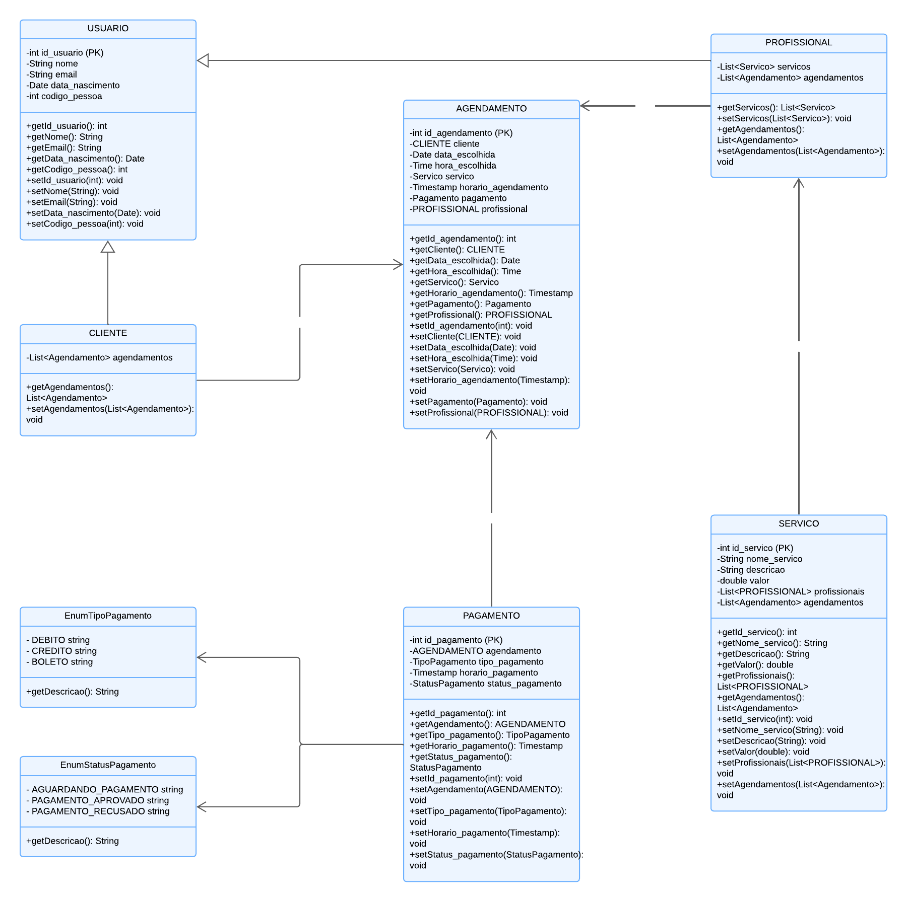
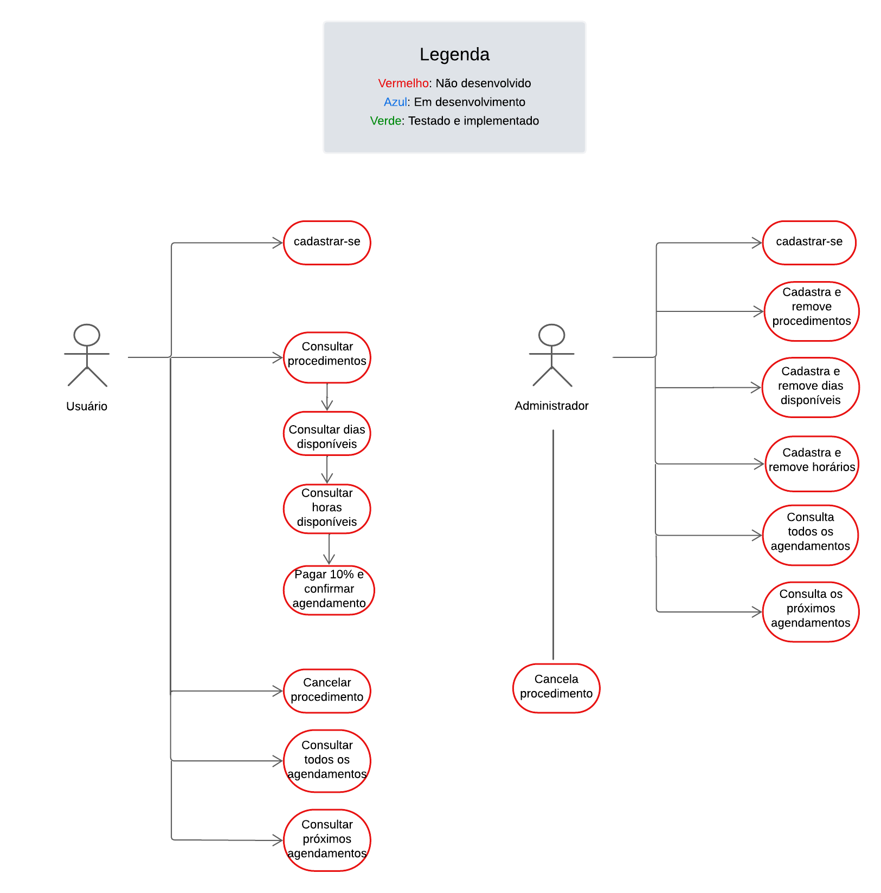

# Sistema de Agendamento 📅
**Objetivo:** Desenvolver um sistema de agendamento online que permita aos usuários marcar serviços ou procedimentos com profissionais de forma totalmente virtual. O sistema deve incluir a opção de pagamento antecipado de 10% do valor total do serviço, com a política de reembolso não aplicável para cancelamentos feitos dentro das 24 horas anteriores à data agendada.

## Resumo técnico
**Resumo:** O Sistema de Agendamento tem como objetivo desenvolver uma aplicação modular em Java, voltada para facilitar o agendamento online de serviços e procedimentos. A estrutura utilizará herança de classes, com uma tabela única no banco de dados para gerenciar as hierarquias de classes, enquanto as outras funcionalidades terão suas tabelas específicas. O foco de desenvolvimento tem sido a criação de endpoints RESTful que atendem aos casos de uso principais do sistema, como criação, consulta, cancelamento e histórico de agendamentos, além de operações específicas para profissionais, que podem gerenciar suas próprias agendas e horários. A persistência de dados será gerenciada pelo Spring Data JPA, facilitando a interação com o banco MySQL.

## Diagrama de classes

## Diagrama de caso de uso

## Endpoints disponíveis

### Serviço Cliente

 Método HTTP | URL                                     | Descrição                                       | Dados de Entrada                                                                       | Dados de Saída                     |
|-------------|-----------------------------------------|-------------------------------------------------|----------------------------------------------------------------------------------------|------------------------------------|
| POST        | http://localhost:8081/cadastro          | Cadastra usuário do tipo CLiente na base        | JSON com os parâmetros nome, dataNascimento, email e codigoPessoa                      | Cliente criado em formato JSON     |
| GET         | http://localhost:8081/cadastro/{codigo} | Consulta usuário do tipo Cliente na base        | Parâmetro codigo na URL                                                                | Cliente específico em formato JSON |
| PUT         | http://localhost:8081/cadastro/{codigo} | Altera dados do usuário do tipo Cliente na base | JSON com os parâmetros opcionais nome, dataNascimento, email e parâmetro codigo na URL | Cliente atualizado em formato JSON | 
| DELETE      | http://localhost:8081/cadastro/{codigo} | Remove usuário do tipo Cliente na base          | Parâmetro codigo na URL                                                                | Mensagem de sucesso ou erro        |

##  Variáveis necessárias para rodar o projeto localmente

 Variável      | Valor                               | Observação                                                              |
|---------------|-------------------------------------|-------------------------------------------------------------------------|
| `DB_JDBC_URL` | jdbc:mysql://localhost/agendamentos | Necessário criar o schema 'agendamentos' no banco de dados MySQL        |
| `DB_USUARIO`  | ?                                   | Preencher com o nome do seu usuário root ou outro que esteja utilizando |
| `DB_PASSWORD` | ?                                   | Preencher com a senha do seu usuário                                    |

